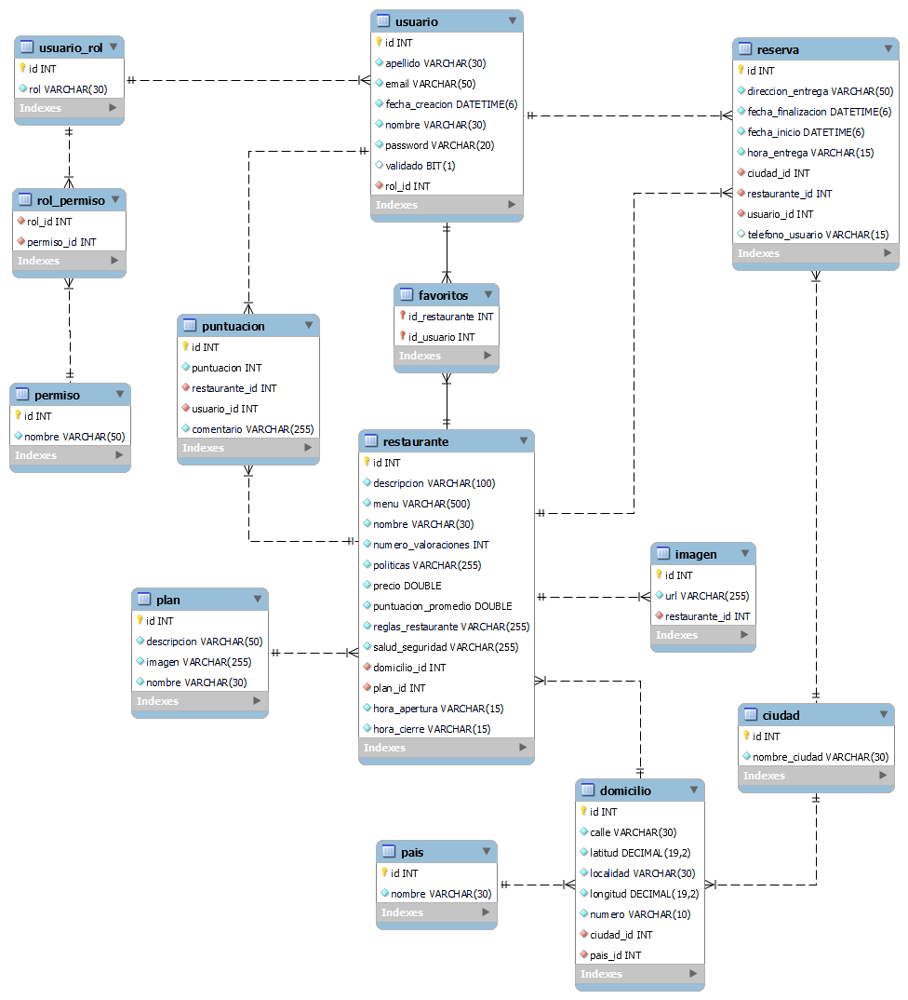
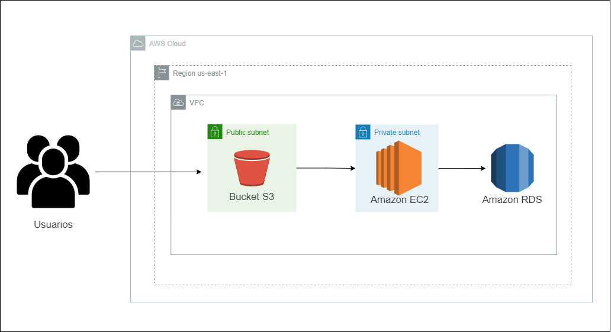

## Proyecto Integrador -  Bukinfood

Enlace aplicación:  http://proyectodh.bukinfood.online.s3-website.us-east-2.amazonaws.com/home<br/>

---

- **Nombre del proyecto:** **_Bukinfood_**
- **Resumen general del proyecto:** Durante el último bimestre del primer track de la carrera Certified Tech Developer, se desarrolló la aplicación Bukinfood. Durante este período, se aplicaron los conocimientos adquiridos tanto en programación como en habilidades blandas. Bukinfood surge como respuesta a la necesidad de ofrecer un servicio de entrega de almuerzos a domicilio para aquellas personas que, debido a su trabajo, falta de tiempo u otras razones, no pueden preparar su propia comida. Con Bukinfood, los usuarios tienen la posibilidad de elegir entre distintos planes para recibir sus almuerzos, como el plan semanal, quincenal, mensual o trimestral. Estos planes brindan ventajas significativas, ya que permiten a los usuarios ahorrar dinero en comparación con la compra diaria de almuerzos, además de economizar tiempo al evitar la necesidad de cocinar. <br>
En cuanto a la navegación, un usuario que no haya iniciado sesión en la aplicación podrá buscar restaurantes desde la página de inicio utilizando la barra de búsqueda. También podrá explorar los restaurantes recomendados o buscar por planes. Podrá acceder a la información detallada de cada restaurante, sin embargo, al querer hacer una reserva de un plan ofrecido por alguno de los restaurantes, será necesario iniciar sesión o registrarse. <br>
Una vez que el usuario inicie sesión, podrá realizar reservas, revisar su historial de reservas, agregar restaurantes a su lista de favoritos y calificarlos. Además, el usuario administrador tendrá la capacidad de gestionar los restaurantes, los planes, los permisos de los usuarios, los roles y las ciudades según las necesidades administrativas de la aplicación.

- **Objetivo del equipo al realizar el proyecto:** Que el equipo trabajará en colaboración, aplicando sus conocimientos técnicos y habilidades de comunicación para entregar un producto final que cumpla con las expectativas de los usuarios y requerimientos solicitados para finalizar con éxito el primer track de la carrera. <br>

## Equipo

- **Betancurc Camila**

- **Cáceres Carolina**

- **Cardenas Nicolás**

- **Cediel Juan Pablo**

- **Pérez Leonel**

- **Rojas César**<br>
Soy matemático, durante mi último año de universidad fui tutor de cursos de matemáticas donde acompañe a estudiantes de diversas carreras en su proceso de aprendizaje, al terminar la carrera conocí por redes sociales Certified Tech Developer de Digital House, me pareció bastante interesante y decidí emprender este viaje al mundo increíble de la programación. <br>
Para el proyecto integrador, trabajé en:

  - Sprint 1
    - rol: Infraestructura
    - Tareas: Diseño del diagrama de redes, creación y configuración de Bucket en S3 para las imágenes.

  - Sprint 2
    - rol: Infraestructura y Backend
    - Tareas: Crear instancia de EC2, crear Bucket en S3 para el sitio web y configurarlos, crear API's para el login y detalles de usuario. Despliegue en AWS vía pipelines usando Gitlab.

  - Sprint 3
    - rol: Backend, Frontend, Infraestructura
    - Tareas: Gestión de roles y permisos de los usuarios, puntuación del producto y administración de la infraestructura.

  - Sprint 4
    - rol: Infraestructura, testing
    - Tareas: Crear enlace personalizado del sitio web, gestión de planes desde el panel de administración y hacer test del Backend en Postman, agregar comentarios al dar una puntuación del producto e informe final.

  - Fortalezas
    - Front end 🔵🔵⚪
    - Back end 🔵🔵🔵
    - Infraestructura 🔵🔵🔵
    - Testing / QA 🔵🔵⚪
    - Bases de datos 🔵🔵🔵

## Metodología de trabajo

La metodología de trabajo utilizada en el desarrollo del proyecto fue Scrum. Se basa en un enfoque iterativo e incremental, en el que el trabajo se divide en sprints de tiempo fijo, en este caso fueron cuatro sprints cada uno con duración de dos semanas. Durante cada sprint, se realizaron actividades de planning, dailys, review y retrospectiva para asegurar la entrega continua de valor al cliente y mejorar el trabajo del equipo.

Al utilizar Scrum, se encontraron varios aspectos positivos en la experiencia de trabajo en equipo como colaboración, comunicación efectiva, flexibilidad, adaptabilidad y respeto, lo que nos permitió aprovechar las fortalezas individuales y trabajar juntos hacia los objetivos comunes. Las reuniones de planificación del sprint y las revisiones ayudaron a alinear a todos los miembros y mantener un enfoque colectivo. A pesar de los beneficios, también hubo algunos desafíos en el uso de Scrum como la gestión del tiempo, cambios constantes y algunos requerimientos ambiguos.

Durante el primer sprint, cada integrante asumió un rol asignado en función al área de mayor afinidad. En el segundo sprint, la asignación de roles fue similar, aunque algunos integrantes desempeñaron dos roles simultáneamente. En el tercer sprint, debido a la presencia de carryover del sprint anterior, cada integrante tuvo que hacerse responsable de varias historias de usuario, esto implicó que cada persona se encargara tanto del desarrollo del backend como del frontend, además de la administración de las bases de datos asociadas a sus respectivas historias asignadas. Por último, en el último sprint, al no tener carryover, cada integrante tuvo menos roles asignados, y algunos se encargaron del testing para terminar la documentación final y los test unitarios.

## Bitácora del proyecto

**Sprint 1:** Durante el primer sprint, nos enfrentamos a la etapa inicial del proyecto. Tuvimos que establecer la planning, definir los roles y asignarlos, familiarizarnos con los requerimientos y la prioridad que tenían. Uno de los desafíos que enfrentamos fue la definición de la idea de negocio al inicio del sprint, hacer la planning, el manejo del Trello y respetar los roles. Para resolverlo, asistimos a reuniones diarias (dailies) para discutir las dudas y ver los avances, también fue necesario reunirnos en las tardes para poder dialogar y tener un espacio de trabajo colaborativo, en la weekly buscar aclaraciones adicionales por parte del Product Owner. Además, utilizamos la retrospectiva para analizar lo sucedido, respetar los roles asignados, el uso adecuado del Trello y pensar cómo diseñar mejor la planning.

**Sprint 2:** En el segundo sprint, la asignación de roles fue similar a la del primer sprint. Se estableció de mejor manera la planning, se respetaron los roles y responsabilidades, se decidió no tomar todos los requerimientos solicitados para el sprint, solo fueron trabajados los que tenían prioridad alta y algunos de media. Hubo un mejor manejo del tiempo y del Trello. En la retrospectiva se decidió implementar una columna de QA en el Trello para verificar que las funcionalidades implementadas no tuvieran fallos y estuvieran completas acorde a los criterios de aceptación.

**Sprint 3:** En el tercer sprint, al tener carryover del sprint anterior y de que el equipo no quería tener deudas para empezar el sprint final decidimos tomar todas las historias de usuario del tercer sprint y las que quedaron pendientes del segundo sprint, cada integrante tuvo que hacerse responsable de varias historias de usuario, esto implicó que cada persona se encargara tanto del desarrollo del backend como del frontend, además de la administración de la base de datos asociada a sus respectivas historias asignadas. Fue un poco complicado estar en áreas en las que se tenía poca afinidad, pero debido a la buena colaboración, ambiente de trabajo y responsabilidad se logró cumplir con las historias requeridas. En la retrospectiva se conversó acerca de no dejar tareas a última hora para poder tener mayor de corregirlas en caso de ser necesario.

**Sprint 4:** En el cuarto sprint, se trabajaron en todas las historias de usuario del sprint y en implementar algunas mejoras con base en la review anterior, además algunos integrantes colaboraron en la parte de test unitarios del backend y frontend.

**Fortalezas del equipo:** Una de las fortalezas clave del equipo fue nuestra capacidad de colaboración, comunicación efectiva y el ambiente de trabajo. Todos los miembros se mostraron dispuestos a ayudarse mutuamente y compartir conocimientos. Esto nos permitió abordar los desafíos de manera conjunta y resolver problemas de forma más rápida y eficiente. Además, supimos aprovechar nuestras habilidades individuales y asignar tareas de acuerdo con las fortalezas de cada miembro, lo que contribuyó al progreso del proyecto.

## Tecnologías utilizadas

**Desarrollo del proyecto:**

- Entornos de desarrollo integrados (IDEs): IntelliJ IDEA Community y Visual Studio Code.
- Sistemas de control de versiones: Git (GitLab).
- Simulación / Virtualización: Utilización de una cuenta en Amazon Web Services (AWS).

**Tecnologías utilizadas para el desarrollo del sitio:**

- **Frontend**

  - React
    - react-router-dom (rutas)
    - react-datepicker (calendario)
    - react icons (iconos)
    - sweet alert (alertas)
    - swiper (slider)
    - google maps
  - CSS

- **Backend**

  - Java
    - Spring
    - Spring Boot
    - Spring Security
    - API Rest
    - Servicios de AWS (S3)
    - Jsoup
  - JWT
  - Maven

- **Base de datos**

  - MySQL

- **Infraestructura**

  - AWS
    - RDS para la base de datos MySQL
    - EC2 para alojar el backend
    - Dos buckets en S3, uno para alojar las imágenes y el otro para el sitio web estático del frontend.
    - Despliegues automatizados en AWS utilizando pipelines en GitLab

- **Testing**
  - Selenium
  - Postman

## Documentación técnica del proyecto

### **Ambiente de desarrollo**

**Instrucciones para armar el ambiente de desarrollo para un nuevo integrante**

- Instalación de los IDEs: IntelliJ IDEA y Visual Studio Code.
- Instalación de MySQL Workbench
- Instalación de Postman
- Instalación de Git
- Clonar el repositorio
- Ir a la carpeta 'equipo-7'
- Abrir la carpeta 'Backend' en IntelliJ y la carpeta 'Frontend' en Visual Studio Code.

**Base de datos:**

  - Abrir MySQL WorkBench y ejecutar los siguientes scripts para creación del esquema e inserción de datos en tablas
  - Script para crear el esquema: schema_bukinfood.sql
  - Script para inserción de datos: insert_bukinfood.sql

- Estructura y diagrama<br>



**Backend:**

- Poner credenciales del username y password de MySQL WorkBench en el application.properties
- Ejecutar el proyecto de Intellij.
- Usar http://localhost:8080 para probar las API's que están documentadas en las secciones de testing en la Wiki del proyecto.

**Frontend:**

 - Abrir una terminal en Visual Studio code que esté ubicada en la carpeta de Frontend
 - Ejecutar los siguientes comandos

```
$ npm install --force
```

```
$ npm run dev
```

- Se ejecutará el proyecto del frontend en http://localhost:5173

**Infraestructura**

- Estructura y diagramas



**Testing**

- Informe Final de testing: El informe está en la Wiki del repositorio, en la sección de Sprint 4.
